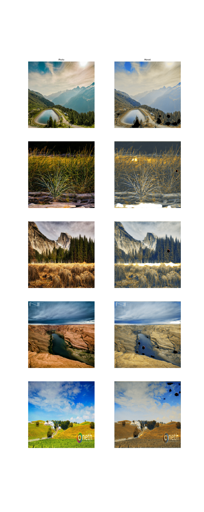

Key Alterations
=======================================================================================
 - Replaced ReLU in residual base with LeakyReLU
 - Reorganized operations in upsample and downsample blocks in Unet

Training
=======================================================================================
 - **Epochs** 16
 - **Steps** 300
 - **Learning Rate** 2e-3
 - **Generator Dropout** 0
 - **Discriminator Dropout** 0.5
 - **Loss Weights** 1, 1, 10
 - **Alternated** No

Outcome
=========================================================================================
 - **Duration** 1hr 6min

Analysis
=======================================================================================
 - The networks appear to be learning a brightness correlation, and not mutating the
   style as wanted. This is a good indicator that overfitting is occurring, and that 
   augmentation should be applied in the training process.
 - The random spots within images are reappearing. By the experimental history in this
   project, I assume this is primarily due to the removal of the generator's dropout.

Next Steps
=======================================================================================
 - Reintroduce spatial dropout to the generator architecture
 - Introduce differentiable augmentations to the discriminator inputs