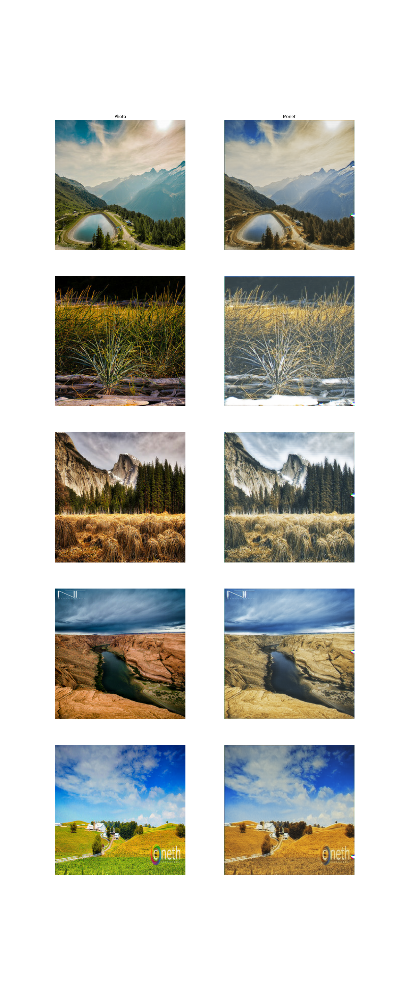

Key Alterations
=========================================================================================
 - Removed spatial dropout from the final upsample layer of the generator
 - Decreased depth of PatchGAN from 5 to 4 (receptive field from 69 to 71)
 - Added cutout and translation differentiable augmentations to training procedure

Training
=========================================================================================
 - **Epochs** 16
 - **Steps** 300
 - **Learning Rate** 2e-4
 - **Generator Dropout** 0.5, 0.5, 0.5
 - **Discriminator Dropout** 0.5
 - **Loss Weights** 1, 1, 1
 - **Alternated** No
 - **Augmentations** Brightness, Color, Contrast, Saturation, Cutout, Translation

Outcome
=========================================================================================
 - **Duration** 1hr 9mins
 - **MIFID Score** NA

Analysis
=========================================================================================
 - Color has indeed been restored to the generator outputs. It appears that generators
   learn the appropriate coloration schemes within the first few epochs. 
 - The texture also adapts slowly over time, though it too converges rather quickly. 
   Unfortunately, the learned textures are not quite as dramatic a change as one would 
   hope. This could be the result of the cycle loss encouraging the transformed images to 
   embed information from the original style as described in "CycleGAN with Better 
   Cycles" by Tongzhou Wang and Yihan Lin.
 - The clipped spots in the generated images slowly deteriorate in size and frequency 
   during training. While this could be caused by any of the implemented losses, it is a
   comfort to know that something in the loss architecture is combatting these artifacts.
   The spots appear to be most common along the image edges... this combined with the 
   frames that have been generated around images lead me to think it may be time for some
   padding configuration.

Next Steps
=========================================================================================
 - Discriminator validation. It would be nice to have some form of measurement of 
   whether or not the discriminator is overfitting.
 - Remove spatial dropout from upstack? I often find this kind of pattern extending
   quite far in effect.
 - Configure symmetric, repeated, or reflective padding to reduce artifacts around image
   edges.