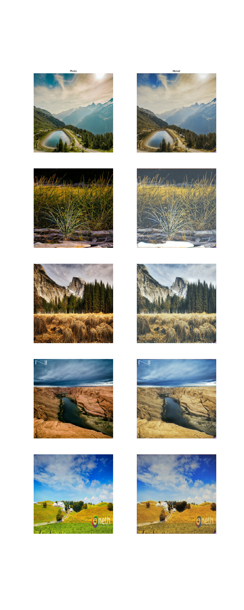

Key Alterations
=========================================================================================
 - Added exponential learning rate scheduler
 - Added individual optimizers for each model to capitalize on Adam algorithm

Training
=========================================================================================
 - **Epochs** 30
 - **Steps** 500
 - **Learning Rate** 2e-4, 1e-5
 - **Generator Dropout** 0.5
 - **Discriminator Dropout** 0.5
 - **Loss Weights** 1, 1, 1
 - **Alternated** No
 - **Augmentations** Brightness, Color, Contrast, Saturation, Cutout, Translation

Outcome
=========================================================================================
 - **Duration**
 - **MIFID Score**

Analysis
=========================================================================================
 - 

Next Steps
=========================================================================================
 - Discriminator validation. It would be nice to have some form of measurement of 
   whether or not the discriminator is overfitting.
 - Remove spatial dropout from upstack? I often find this kind of pattern extending
   quite far in effect.
 - Configure symmetric, repeated, or reflective padding to reduce artifacts around image
   edges.